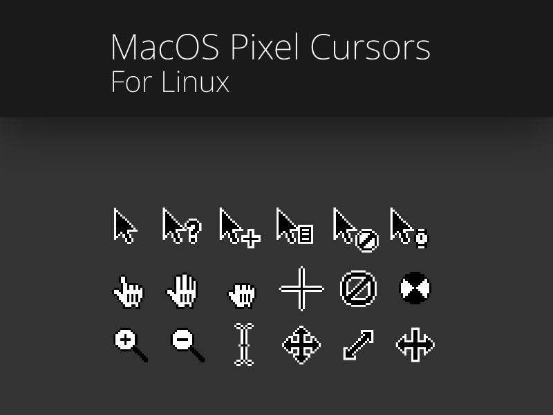

## DO NOT USE THE DOWNLOAD ZIP BUTTON TO DOWNLOAD THE FILES.

 MacOS-inspired pixel cursors for Linux.

### Currently this only supports 1080p at 100% scaling

# How To Install

#### 1. Clone the repo
- Go to the releases area on the right sidebar and download the latest release's tar.gz file.
- You can also use the command `git clone https://github.com/Meelee35/Pixel-MacOS-Cursors.git` and then skip step 2

#### 2. Extract the archive
Extract the .tar.gz file you downloaded.

#### 3. Place the extracted folder into the correct location.
- For user installation, move the extracted folder to `~/.local/share/icons`. If this doesn't exist, then create it.
- For system installation, move the extracted folder to `/usr/share/icons`. This will require root privileges.

